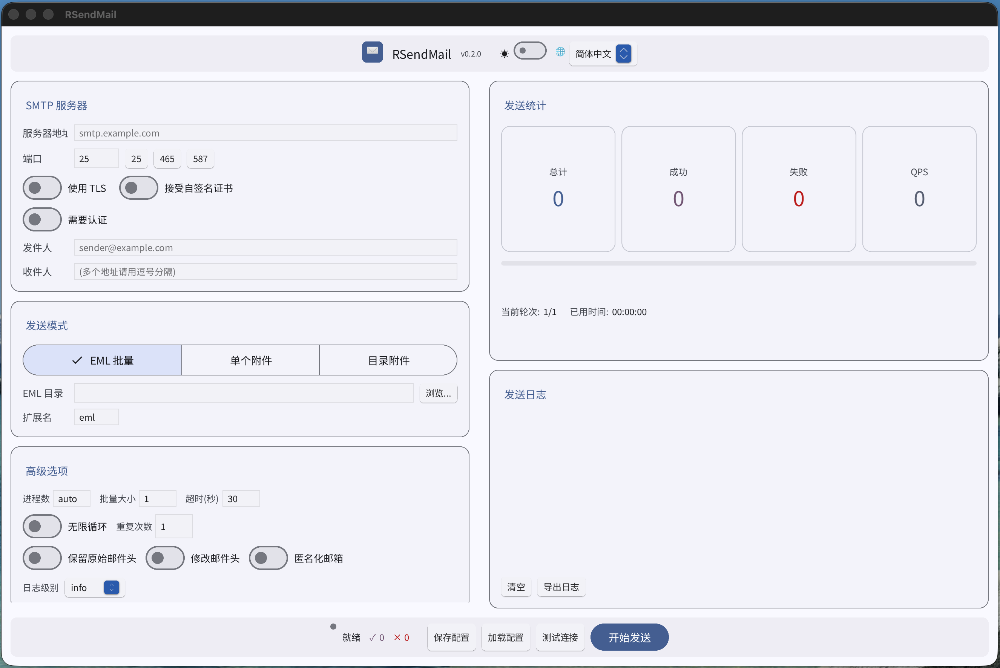
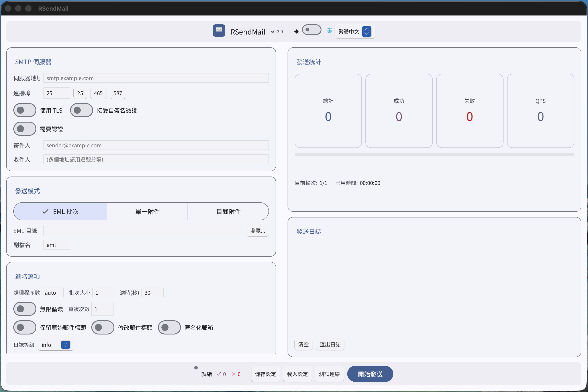
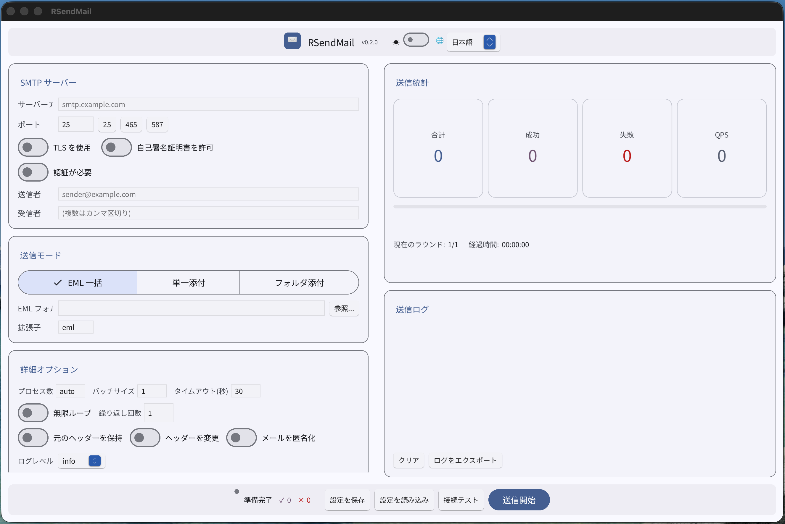

# RSendMail

大量メール送信用の高性能テストツール

[English](README.md) | [简体中文](README_zh.md) | [繁體中文](README_zh-TW.md) | 日本語


[](https://deepwiki.com/relaxcloud-cn/RSendMail)

## スクリーンショット

| English | 简体中文 |
|---------|----------|
|  |  |

| 繁體中文 | 日本語 |
|----------|--------|
|  |  |

## 機能

- **CLI と GUI の両モード**：コマンドラインとグラフィカルインターフェースをサポート
- 複数メールの一括処理と送信
- マルチスレッド処理による高性能化
- カスタム SMTP サーバー設定のサポート
- 複数のログレベル（error/warn/info/debug/trace）をサポート
- 詳細なエラー追跡と統計情報
- Docker サポートで簡単デプロイ
- 単一の SMTP セッションでの一括送信をサポート
- 通常ファイルを添付ファイルとして送信可能
- ディレクトリ内のすべてのファイルを個別のメールとして一括送信可能
- **多言語サポート**：英語、簡体字中国語、繁体字中国語、日本語

## 添付ファイル機能について

RSendMail は、EML ファイルを事前に作成することなく、通常のファイルを添付ファイルとして送信することをサポートしています。これはファイル送信のテストを素早く行うのに便利です。

### 添付ファイルモードの特徴

- MIME タイプの自動検出
- メールの件名と本文のカスタマイズが可能
- テンプレート変数による自動ファイル名挿入
- オプションで HTML コンテンツをサポート
- 一括 EML 送信機能とは完全に独立
- 単一ファイルの送信（`--attachment` を使用）またはディレクトリ内の全ファイルの送信（`--attachment-dir` を使用）をサポート
- 添付ファイルモードでは `--dir` パラメータは不要

### テンプレート変数

- `{filename}`: 実際のファイル名（パスなし）に置き換えられます

## 多言語サポート

RSendMail の CLI と GUI インターフェースは複数の言語をサポートしています：

| 言語 | コード | 環境変数 |
|------|--------|----------|
| 英語 | `en` | `RSENDMAIL_LANG=en` |
| 簡体字中国語 | `zh-CN` | `RSENDMAIL_LANG=zh-CN` |
| 繁体字中国語 | `zh-TW` | `RSENDMAIL_LANG=zh-TW` |
| 日本語 | `ja` | `RSENDMAIL_LANG=ja` |

### 言語の設定

**方法1：環境変数**
```bash
# Linux/macOS
export RSENDMAIL_LANG=ja
rsendmail --help

# Windows PowerShell
$env:RSENDMAIL_LANG="ja"
rsendmail --help
```

**方法2：コマンドライン引数**
```bash
rsendmail --lang ja --help
```

**方法3：自動検出**
言語が指定されていない場合、RSendMail は以下の順序でシステム言語を自動検出します：
1. `RSENDMAIL_LANG` 環境変数
2. `LANG` または `LC_ALL` 環境変数
3. システムロケール設定（macOS: AppleLocale）
4. 検出に失敗した場合、デフォルトで英語を使用

### 言語の例

```bash
# 英語でヘルプを表示
RSENDMAIL_LANG=en rsendmail --help

# 簡体字中国語でヘルプを表示
RSENDMAIL_LANG=zh-CN rsendmail --help

# 日本語でヘルプを表示
rsendmail --lang ja --help
```

## ビルド

### ローカルビルド
```bash
cd rsendmail
cargo build --release
```

### Docker ビルド
```bash
docker build -t rsendmail .
```

## 使用方法

### Windows での使用
[Releases](https://github.com/kpassy/RSendMail/releases) ページから Windows 実行ファイル（`rsendmail-windows-x86_64.exe`）をダウンロードしてください。
```bash
rsendmail-windows-x86_64.exe --smtp-server <SMTPサーバー> --port <ポート> --from <送信者> --to <受信者> --dir <メールディレクトリ> --processes <プロセス数> --batch-size <バッチサイズ>
```

### ローカルでの使用
```bash
rsendmail --smtp-server <SMTPサーバー> --port <ポート> --from <送信者> --to <受信者> --dir <メールディレクトリ> --processes <プロセス数> --batch-size <バッチサイズ>
```

### Docker での使用
```bash
docker run --rm -v /path/to/emails:/data rsendmail --smtp-server <SMTPサーバー> --port <ポート> --from <送信者> --to <受信者> --dir /data --processes <プロセス数> --batch-size <バッチサイズ>
```

### パラメータ説明

- `--smtp-server`: SMTP サーバーアドレス
- `--port`: SMTP サーバーポート（デフォルト：25）
- `--from`: 送信者メールアドレス（SMTP エンベロープ用、デフォルトではメール内容を変更しない）
- `--to`: 受信者メールアドレス（SMTP エンベロープ用、複数のアドレスはカンマで区切る、デフォルトではメール内容を変更しない）
- `--dir`: メールファイルが格納されているディレクトリ（EML 送信モードでのみ必要、--attachment または --attachment-dir 使用時は不要）
- `--extension`: メールファイルの拡張子（デフォルト：eml）
- `--processes`: プロセス数、auto で CPU コア数に自動設定、または具体的な数字を指定（デフォルト：auto）
- `--batch-size`: 各 SMTP セッションで連続送信するメール数（デフォルト：1）
- `--smtp-timeout`: SMTP セッションタイムアウト（秒）（デフォルト：30）
- `--log-level`: ログレベル（error/warn/info/debug/trace）（デフォルト：info）
- `--keep-headers`: 元のメールヘッダーを保持（デフォルト：false、modify-headers より優先）
- `--modify-headers`: --from と --to パラメータを使用してメールヘッダーの From と To を変更（デフォルト：false）
- `--anonymize-emails`: すべてのメールアドレスを匿名化（デフォルト：false）
- `--anonymize-domain`: 匿名化に使用するドメイン（デフォルト：example.com）
- `--loop`: ユーザーが中断するまで無限ループでメールを送信（デフォルト：false）
- `--repeat`: 送信を繰り返す回数（デフォルト：1）
- `--loop-interval`: ループ送信の間隔（秒）（デフォルト：1）
- `--retry-interval`: 送信失敗後のリトライ間隔（秒）（デフォルト：5）
- `--attachment`: 添付ファイルのパス、通常のファイルを添付ファイルとして送信
- `--attachment-dir`: 添付ファイルディレクトリのパス、ディレクトリ内のすべてのファイルを個別のメールとして送信（ファイルごとに1通）
- `--subject-template`: 件名テンプレート、変数 {filename} をサポート（デフォルト："添付ファイル: {filename}"）
- `--text-template`: テキスト内容テンプレート、変数 {filename} をサポート（デフォルト："添付ファイルをご確認ください: {filename}"）
- `--html-template`: HTML 内容テンプレート、変数 {filename} をサポート
- `--email-send-interval`: 一括送信時の各メール間の送信間隔（ミリ秒、デフォルト：0）
- `--auth-mode`: メールアカウントログインモードを有効化（ユーザー名とパスワードで認証して送信）
- `--username`: メールアカウントのユーザー名（auth-mode 有効時に必須）
- `--password`: メールアカウントのパスワード（auth-mode 有効時に必須）
- `--use-tls`: TLS 暗号化接続を使用（ポートが 465 の場合は自動的に有効）
- `--accept-invalid-certs`: 無効な TLS 証明書を受け入れる（TLS 使用時のみ）。警告：これはセキュリティを低下させます。対象サーバーを信頼する場合のみ使用してください。
- `--failed-emails-dir`: 送信失敗した EML ファイルの保存ディレクトリ（指定すると、失敗したメールは自動的にこのディレクトリにコピーされ、ファイル名にはタイムスタンプが追加されて上書きを防止）
- `--log-file`: ログファイルの保存パス（指定すると、ログはコンソールとファイルの両方に出力され、実行記録の保存に便利）
- `--lang`: 表示言語（en/zh-CN/zh-TW/ja）、環境変数 `RSENDMAIL_LANG` でも設定可能

## ログレベル

アプリケーションは出力の詳細度を制御するために異なるログレベルをサポートしています：

- `error`: エラーメッセージのみ表示
- `warn`: 警告とエラーメッセージを表示
- `info`: 一般的な進捗情報を表示（デフォルト）
- `debug`: 詳細なデバッグ情報を表示
- `trace`: 最も詳細なトレース情報を表示

## 使用例

```bash
# デフォルトのログレベル（info）
rsendmail --smtp-server 192.168.1.100 --port 25 --from sender@example.com --to recipient@example.com --dir ./emails --processes 10 --batch-size 5

# 詳細なデバッグログ
rsendmail --smtp-server 192.168.1.100 --port 25 --from sender@example.com --to recipient@example.com --dir ./emails --processes 10 --batch-size 5 --log-level debug

# エラーメッセージのみ表示
rsendmail --smtp-server 192.168.1.100 --port 25 --from sender@example.com --to recipient@example.com --dir ./emails --processes 10 --batch-size 5 --log-level error

# Docker 実行例
docker run --rm -v $(pwd)/emails:/data rsendmail --smtp-server 192.168.1.100 --port 25 --from sender@example.com --to recipient@example.com --dir /data --processes 10 --batch-size 5 --log-level info

# 単一添付ファイル送信例（--dir パラメータ不要）
rsendmail --smtp-server 192.168.1.100 --port 25 --from sender@example.com --to recipient@example.com --attachment ./document.pdf

# カスタムテンプレートで添付ファイルを送信（--dir パラメータ不要）
rsendmail --smtp-server 192.168.1.100 --port 25 --from sender@example.com --to recipient@example.com --attachment ./document.pdf --subject-template "重要ファイル: {filename}" --text-template "お世話になっております。\n\n添付ファイル：{filename} をご確認ください。\n\nよろしくお願いいたします。\nRSendMailチーム"

# ディレクトリ内のすべてのファイルを個別のメールとして一括送信（--dir パラメータ不要）
rsendmail --smtp-server 192.168.1.100 --port 25 --from sender@example.com --to recipient@example.com --attachment-dir ./documents --subject-template "ファイル: {filename}"
```

## ドキュメント

- [アーキテクチャ設計](docs/ARCHITECTURE_ja.md) - 詳細なアーキテクチャと設計ドキュメント

## ライセンス

MIT License
